# Лабораторная работа №8 Работа с базой данных.

## Веб сайт для Каршеринговой компании.

 Задача: разработать веб-сайт с реализацией CRUD функционала, регистрацией и админ-панелью.

## 1.Архитектура приложения.

В данной лабораторной работе я выбрал MVC паттерн.

MVC - это архитектурный шаблон, разделяющий приложение на три компонента: Модель (данные/логика), Представление (интерфейс/HTML) и Контроллер (управление/связь). Это структурирует код, облегчает поддержку и позволяет независимо менять логику и внешний вид.

## 2. База данных
Я использовал язык Posgres + PgAdmin за его простоту, современность, скорость и возможности. Весь бэкенд написан на языке `php`. к нему я подключил `composer`, шаблонизатор `twig` и переменные окружения `vlucas/dotenv`

Запуск приложения происходит из `Docker` кластера контейнеров  `backend+database+pgadmin`.

## 3. Авторизация
1. При заходе на сайт, проверяем есть ли активная сессия пользователя. Если нет, даем выбор между регистрацией и авторизацией.

1. При регистрации Пользователь заполняет все необходимые поля. При авторизации необходимо по логину и паролю обнаружить в списках клиентов. если есть - пускаем.
2. Через классы валидаторы система проверяет коррекность данных и оповещает в виде модального окна с ошибками.
3. Если данные в порядке, с помощью контроллера и набора классов репозиториев отправляются запросы в базу данных с защитой от SQL иньекций и маршрутизируют на нужную страницу. Пароли хешируются через функцию password_hash();
4. Если клиент в таблице клиентов в поле role = админ, он имеет доступ к редактированию почти всех полей других пользователей.

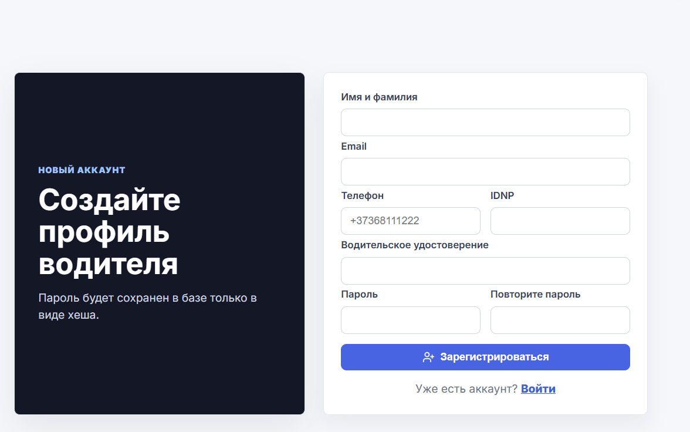

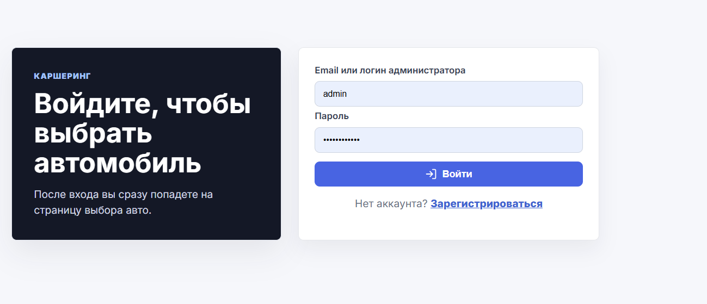


## 4. Обзор функционала

### Выбор автомобиля вместе с фильтрами и сортировкой
 
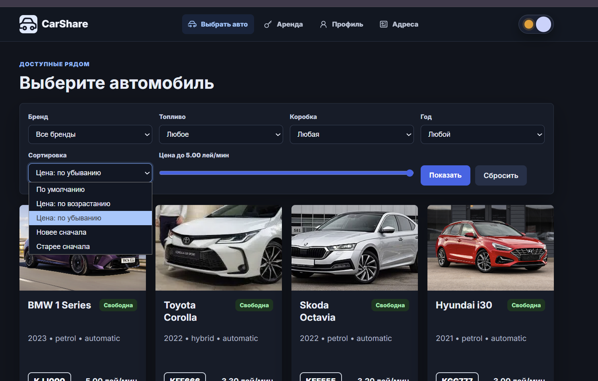

### Оформление аренды
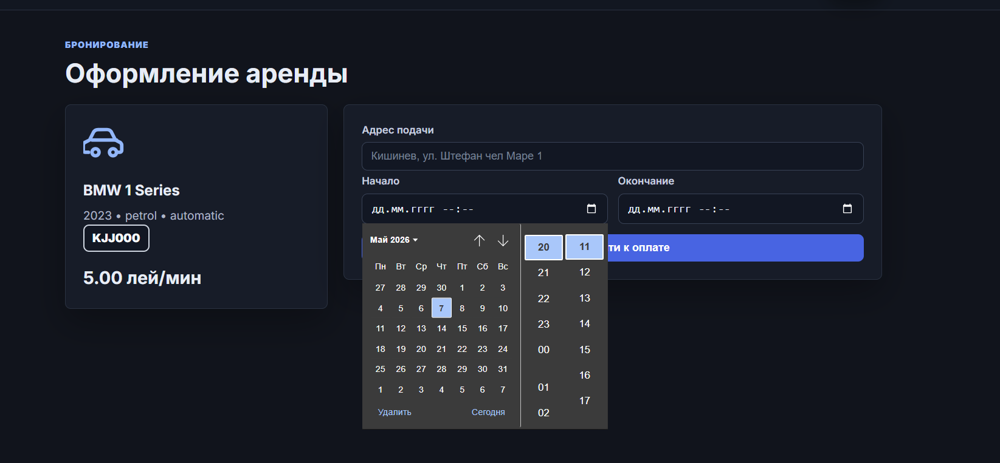

### Оплата, ввод данных карты вместе с итоговой суммой.
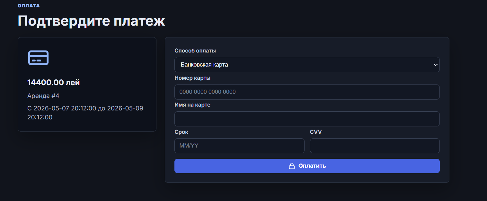

### Профиль пользователя
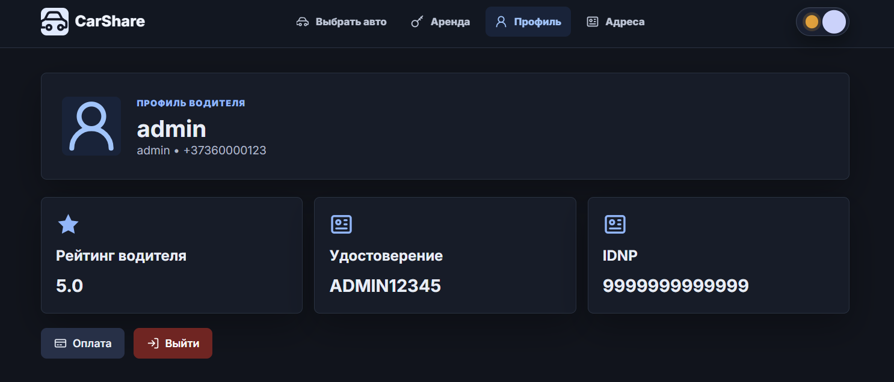

### Добавление/Удаление адресов с возможностью открытия в GOOGLE MAPS.

### Светлая и темная тема сайта.
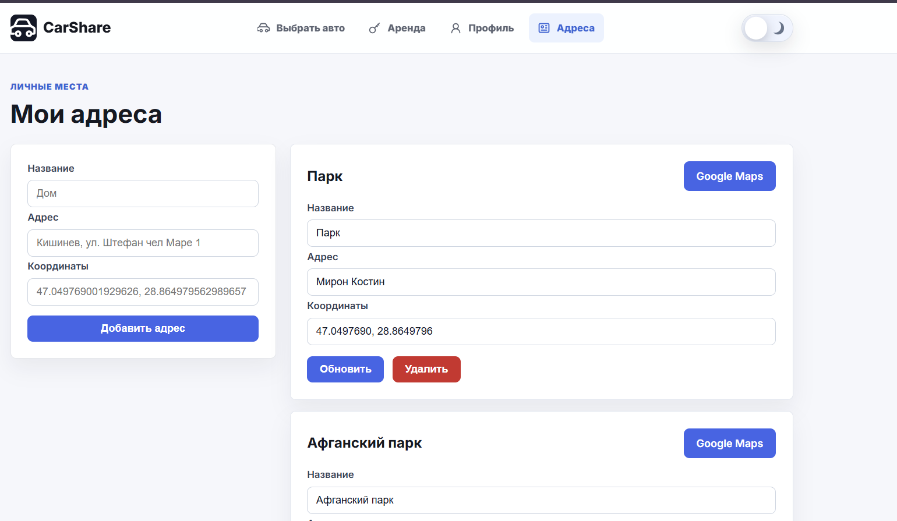

### Админ панель для персонала
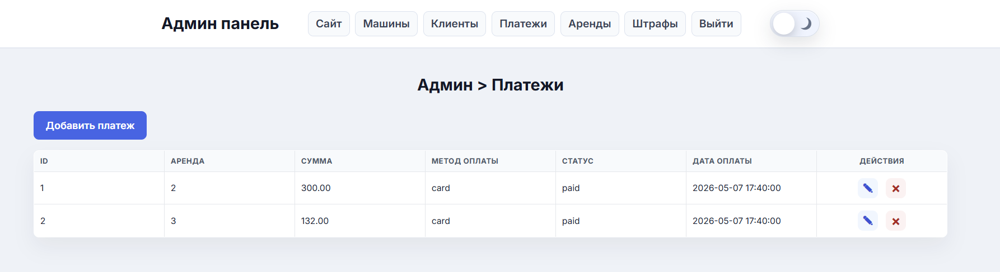

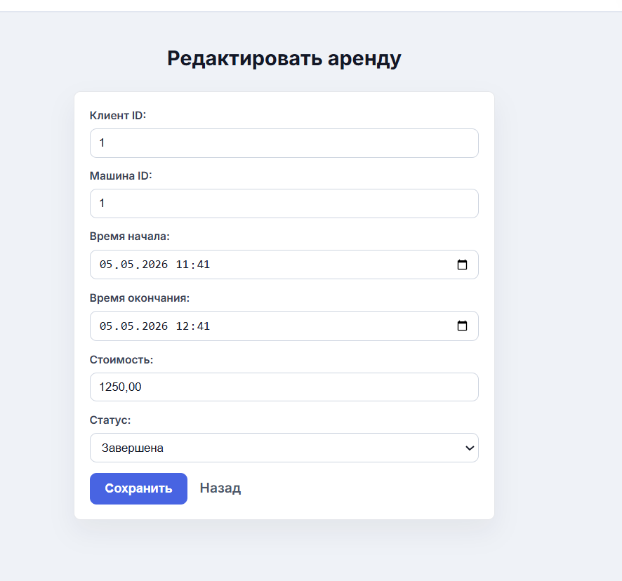

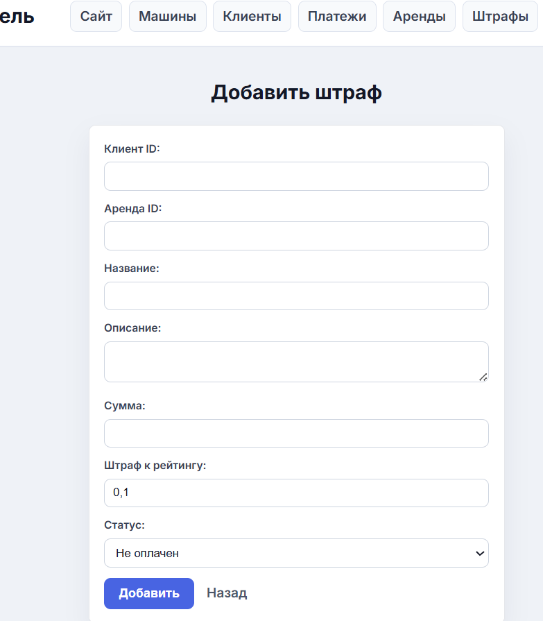

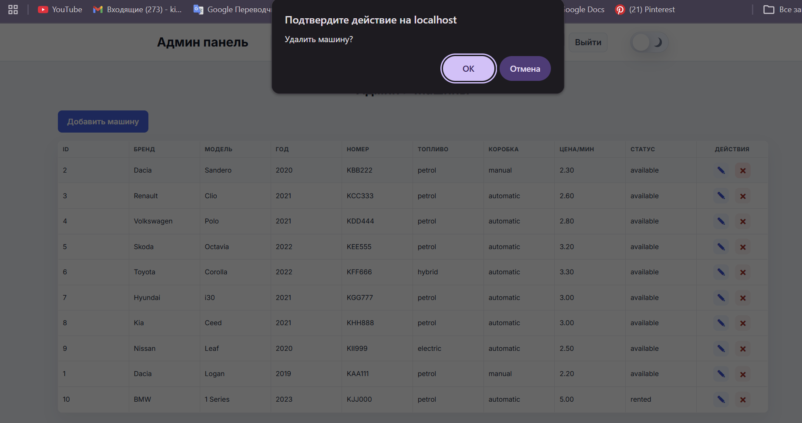

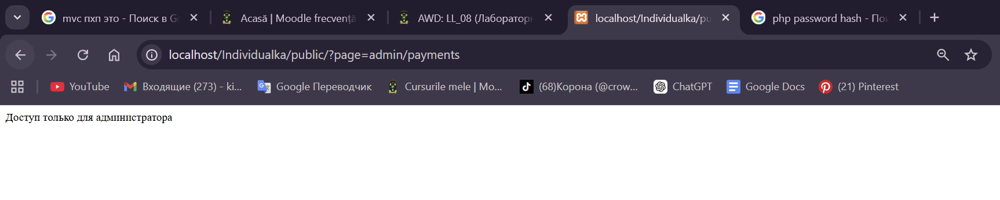

## Что такое PDO?
PDO (PHP Data Objects) — это интерфейс для работы с базами данных в PHP через единый API.

---

## Чем PDO отличается от устаревших расширений mysqli_*?
- PDO поддерживает разные СУБД: MySQL, PostgreSQL, SQLite и др.
- `mysqli` работает только с MySQL.
- PDO удобнее для prepared statements.
- Старые `mysql_*` расширения устарели и удалены.

---

## Что такое подготовленные выражения?
Подготовленные выражения (prepared statements) — это SQL-запросы с параметрами, значения которых передаются отдельно.

Пример:
```php
$stmt = $pdo->prepare("SELECT * FROM users WHERE id = :id");
$stmt->execute(['id' => $id]);
```

---

## Зачем нужны подготовленные выражения?
- защита от SQL-инъекций;
- безопасная передача данных;
- более чистый код;
- удобно переиспользовать запросы.

---

## Как prepared statements защищают от SQL-инъекций?
SQL-запрос и данные отправляются отдельно.  
Пользовательский ввод не может изменить структуру SQL-запроса.

---

## Что такое транзакция?
Транзакция — это группа SQL-операций, выполняемых как одно целое.

Если одна операция завершится ошибкой — можно отменить все изменения.

---

## В каких ситуациях использовать транзакции?
Когда несколько запросов должны выполниться вместе:
- перевод денег;
- оформление аренды;
- создание заказа и оплаты;
- изменение нескольких связанных таблиц.

---

## Пример транзакции
```php
$pdo->beginTransaction();

try {
    // SQL-запросы

    $pdo->commit();
} catch (Exception $e) {
    $pdo->rollBack();
}
```

---

## Что делают beginTransaction(), commit(), rollback()?

### beginTransaction()
Начинает транзакцию.

### commit()
Подтверждает изменения в базе данных.

### rollBack()
Отменяет все изменения после начала транзакции.

---

## Чем отличается fetch() от fetchAll()?

### fetch()
Возвращает одну строку результата.

```php
$row = $stmt->fetch();
```

### fetchAll()
Возвращает все строки массивом.

```php
$rows = $stmt->fetchAll();
```

---

## NoSQL база данных MongoDB

Кроме реляционной базы PostgreSQL в проект добавлена NoSQL база MongoDB. PostgreSQL остается основной базой для структурированных данных: клиентов, машин, аренд, оплат и штрафов. MongoDB используется как документное хранилище для журнала событий приложения.

В MongoDB создается коллекция:

```text
carsharing_nosql.audit_logs
```

В нее записываются события:

- `login` - вход пользователя;
- `registration` - регистрация клиента;
- `rental_created` - создание аренды;
- `payment_created` - успешная оплата;
- `rental_finished` - завершение аренды.
- `admin_car_created`, `admin_car_updated`, `admin_car_deleted` - действия администратора с машинами;
- `admin_client_created`, `admin_client_updated`, `admin_client_deleted` - действия администратора с клиентами;
- `admin_payment_created`, `admin_payment_updated`, `admin_payment_deleted` - действия администратора с оплатами;
- `admin_rental_created`, `admin_rental_updated`, `admin_rental_deleted` - действия администратора с арендами;
- `admin_fine_created`, `admin_fine_updated`, `admin_fine_deleted` - действия администратора со штрафами.

Такой подход показывает работу сразу с двумя типами баз данных:

- PostgreSQL хранит нормализованные связанные таблицы;
- MongoDB хранит гибкие JSON-подобные документы с историей действий.

Настройки MongoDB находятся в `src/data.env`:

```env
MONGODB_URI=mongodb://localhost:27017
MONGODB_DATABASE=carsharing_nosql
```

Для полноценной работы MongoDB нужно установить сам сервер MongoDB и PHP-расширение `mongodb` для XAMPP. Если расширение не установлено, сайт продолжит работать на PostgreSQL, а NoSQL-логирование будет просто пропущено.
